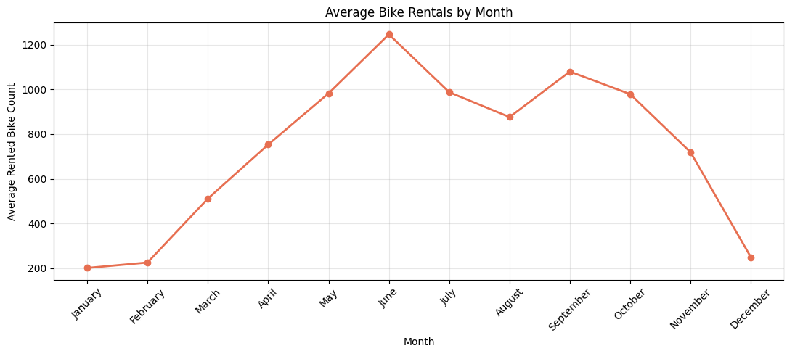
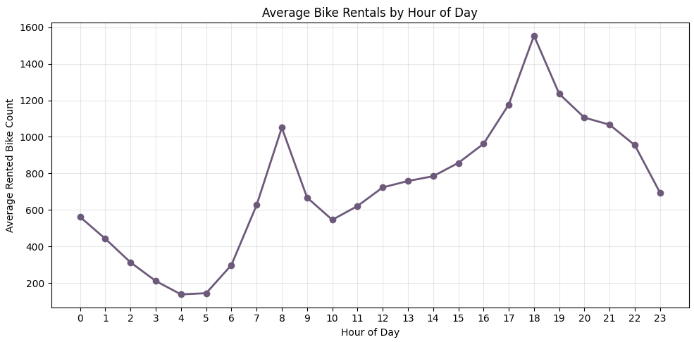
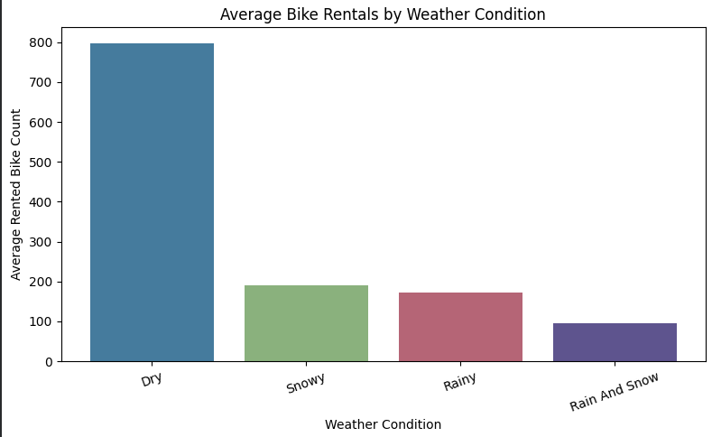
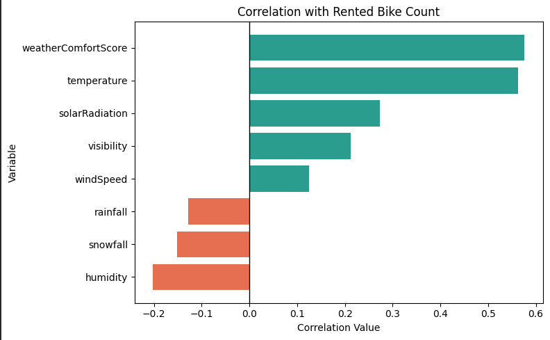
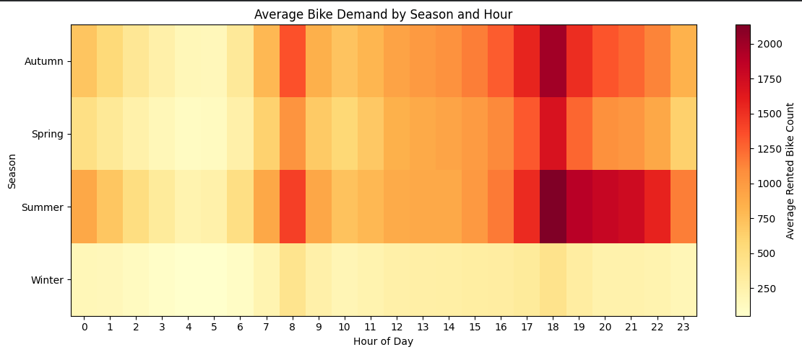

<div align="center">


<br/>

```
╔══════════════════════════════════════════════════════════════════╗
║   🚲  SEOUL BIKE SHARING DEMAND  —  DATA ANALYSIS PROJECT  🚲   ║
╚══════════════════════════════════════════════════════════════════╝
```

# How Weather, Time, and Holidays Affect<br/>Public Bike Rental Demand in Seoul

<br/>

[](https://python.org)
[](https://pandas.pydata.org)
[](https://numpy.org)
[](https://matplotlib.org)
[](https://colab.research.google.com)

<br/>

</div>

---

## 👤 Student Information

<div align="center">

| Field | Details |
|:---|:---|
| **Student Name** | Nurul Azam Bhuiyan |
| **Student ID** | 23-50020-1 |
| **Course** | Programming in Python |
| **Section** | C |
| **Semester** | Spring 2026 |
| **Course Instructor** | MD. TANZEEM RAHAT |
| **Project Type** | Final Term Data Analysis Project |

</div>

---

## 📋 Project Overview

> *"Bike sharing systems are important for modern city transportation — but operators must know **when** demand peaks and **why**."*

This project is a **complete data analysis investigation** using **Pandas**, **NumPy**, and **Matplotlib** on real hourly bike rental data from Seoul's public bike sharing system.

The analysis follows a full professional data workflow:

```
📥 Load  →  🔍 Understand  →  🧹 Clean  →  ⚙️ Engineer  →  📊 Analyze  →  📈 Visualize  →  💡 Conclude
```

---

## 📦 Dataset Information

<div align="center">

| Property | Value |
|:---|:---|
| **Dataset Name** | Seoul Bike Sharing Demand |
| **Source** | UCI Machine Learning Repository |
| **Link** | [🔗 View Dataset](https://archive.ics.uci.edu/dataset/560/seoul+bike+sharing+demand) |
| **Original Rows** | 8,760 hourly records |
| **Original Columns** | 14 |
| **Main Analysis Rows** | 8,465 *(service-open records only)* |
| **Key Variable** | `Rented Bike Count` |
| **Data Types** | Numerical · Categorical · DateTime |

</div>

### 🗂️ Column Categories

| Category | Columns |
|:---|:---|
| 🕐 Time | `Date`, `Hour` |
| 🚲 Demand | `Rented Bike Count` |
| 🌤️ Weather | `Temperature`, `Humidity`, `Wind Speed`, `Visibility`, `Dew Point Temperature`, `Solar Radiation`, `Rainfall`, `Snowfall` |
| 📅 Calendar | `Season`, `Holiday` |
| ⚙️ Service | `Functioning Day` |

---

## ❓ Research Questions

```
┌─────────────────────────────────────────────────────────────────────┐
│  Q1 │ Which TIME factors (hour, month, season, weekend) drive the   │
│     │ highest bike rental demand?                                   │
├─────────────────────────────────────────────────────────────────────┤
│  Q2 │ How do WEATHER factors (temperature, humidity, rainfall,      │
│     │ snowfall, solar radiation) relate to rental demand?          │
├─────────────────────────────────────────────────────────────────────┤
│  Q3 │ Are there UNUSUAL high or low demand hours, and what do       │
│     │ those patterns reveal?                                        │
└─────────────────────────────────────────────────────────────────────┘
```

---

## 🛠️ Tools and Libraries

<div align="center">

| Tool | Purpose |
|:---|:---|
| 🐍 **Python** | Main programming language |
| 🐼 **Pandas** | Data loading, cleaning, filtering, grouping, aggregation, summary tables |
| 🔢 **NumPy** | Percentiles, mean, std, z-score, IQR, custom numerical calculations |
| 📊 **Matplotlib** | All data visualizations |
| ☁️ **Google Colab** | Notebook environment |
| 🐙 **GitHub** | Project submission and version sharing |

</div>

---

## 🔄 Project Workflow

```
Step 01  ┃  Import required libraries
Step 02  ┃  Load dataset directly from UCI
Step 03  ┃  Inspect shape, dtypes, missing values, duplicates
Step 04  ┃  Clean and prepare the dataset
Step 05  ┃  Create engineered features
Step 06  ┃  Grouped analysis and subgroup comparison
Step 07  ┃  Relationship analysis (weather vs demand)
Step 08  ┃  Outlier detection — NumPy z-score and IQR
Step 09  ┃  Create meaningful Matplotlib charts
Step 10  ┃  Summarize evidence-based findings
Step 11  ┃  Discuss limitations
Step 12  ┃  Write final conclusion
```

---

## 🧹 Data Cleaning Steps

| # | Issue Found | Action Taken | Reason |
|:---:|:---|:---|:---|
| 1 | Column names had spaces and special symbols | Renamed to simple camelCase names | Made code easier to write, read, and explain |
| 2 | Possible duplicate rows | Checked and removed exact duplicates | Prevented counting the same hourly record twice |
| 3 | Date column stored as text | Converted using `pd.to_datetime` | Needed for month, day, and weekend features |
| 4 | Numerical columns needed correct format | Converted using `pd.to_numeric` | Needed for statistics, grouping, and visualization |
| 5 | Text categories could be inconsistent | Standardized `season`, `holiday`, `functioningDay` | Prevented incorrect group results |
| 6 | Service-closed rows had zero rentals | Separated service-open and service-closed records | Closed-service zeros ≠ natural customer demand |

---

## ⚙️ Feature Engineering

10 new columns were derived from existing data:

| New Feature | How It Was Created | Why It Is Useful |
|:---|:---|:---|
| `year` | Extracted from date | Supports date-based understanding |
| `monthNumber` | Extracted from date | Keeps months in correct order |
| `monthName` | Extracted from date | Makes monthly results readable |
| `dayName` | Extracted from date | Helps understand day-based patterns |
| `weekendStatus` | Saturday & Sunday → Weekend, others → Weekday | Supports weekday vs weekend comparison |
| `timePeriod` | Grouped hour → Night / Morning / Afternoon / Evening | Makes daily demand patterns easier to explain |
| `weatherCondition` | Derived from rainfall and snowfall | Supports dry / rainy / snowy / mixed comparison |
| `temperatureGroup` | Grouped into Cold / Comfortable / Hot | Shows demand difference by temperature level |
| `demandLevel` | Created using **NumPy percentiles** | Classifies low, medium, and high demand periods |
| `weatherComfortScore` | Temperature + humidity + rain + snow penalties | Simple riding-comfort indicator |

---

## 📊 Analysis Performed

| Analysis Type | Details |
|:---|:---|
| ⏱️ **Time Analysis** | Demand by season, month, hour, weekend status, holiday status, time period |
| 🌦️ **Weather Analysis** | Demand by weather condition and temperature group |
| 🔀 **Subgroup Comparison** | Season · Weekend · Holiday · Weather · Temperature *(5 comparisons)* |
| 🔗 **Relationship Analysis** | Correlation between 8 weather variables and rental count |
| 📡 **Outlier Analysis** | Extreme demand detection using z-score and IQR methods |
| 🔢 **NumPy Computation** | Percentiles, mean, std, z-score, IQR |
| 📈 **Visualization** | Bar charts · Line charts · Scatter plot · Correlation chart · Heatmap |

---

## 💡 Key Findings

<div align="center">

```
┌──────────────────────────────────────────────────────────────────────────┐
│                        TOP FINDINGS AT A GLANCE                          │
├────────────────────────────────────────┬─────────────────────────────────┤
│  🏆 Highest average season             │  Summer  →  1,034 rentals/hr    │
│  📅 Highest average month              │  June    →  1,246 rentals/hr    │
│  🕕 Busiest average hour               │  18:00   →  1,554 rentals/hr    │
│  ☀️  Best weather condition             │  Dry     →    797 rentals/hr    │
│  🌡️  Strongest weather variable         │  Temperature  (r = 0.5627)      │
│  📆 Weekday vs Weekend                 │  748.11  vs  682.38             │
│  🎌 Non-Holiday vs Holiday             │  739.28  vs  529.15             │
│  📈 Z-score outliers (z > 3)           │  63 very high demand records    │
│  📦 IQR high-demand outliers           │  152 records above limit        │
│  🔺 All-time peak record               │  3,556 rentals — 2018-06-19     │
└────────────────────────────────────────┴─────────────────────────────────┘
```

</div>

---

## 📈 Visualizations

### Figure 1 — Average Bike Rentals by Month
> Demand rises from winter, peaks in June, and falls back toward winter.



---

### Figure 2 — Average Bike Rentals by Hour of Day
> A clear evening peak at 18:00 and a secondary morning peak at 08:00 — a classic commuter pattern.



---

### Figure 3 — Average Bike Rentals by Weather Condition
> Dry weather dominates. Rainy and snowy conditions suppress demand by up to 80%.



---

### Figure 4 — Correlation with Rented Bike Count
> Temperature is the strongest individual positive predictor. Humidity has the strongest negative relationship.



---

### Figure 5 — Season × Hour Demand Heatmap
> Brighter = higher demand. Summer evenings stand out as the dominant peak zone.



---

## 🔢 NumPy-Based Computation

NumPy was used meaningfully throughout the analysis:

| Computation | Purpose |
|:---|:---|
| `np.percentile` | Created demand levels and IQR limits |
| `np.mean` | Calculated average rented bike count |
| `np.std` | Calculated standard deviation for z-score |
| **Z-Score Detection** | Flagged 63 very high demand outlier records |
| **IQR Detection** | Flagged 152 high demand outlier records |

### Z-Score Formula

```python
z_score = (rentedBikeCount - np.mean(array)) / np.std(array)
# Records with z > 3  →  flagged as "Very High Demand"
# Records with z < -3 →  flagged as "Very Low Demand"
```

### IQR Formula

```python
Q1  = np.percentile(array, 25)   # → 214
Q3  = np.percentile(array, 75)   # → 1,084
IQR = Q3 - Q1                    # → 870
high_limit = Q3 + 1.5 * IQR      # → 2,389  (outlier threshold)
```

---

## ⚠️ Limitations

- 🌏 Dataset covers **Seoul only** — results may not generalize to other cities
- 📅 Covers approximately **one year** — long-term trends cannot be studied
- 🔍 Missing variables: station location, user type, public transport conditions, special events
- 📉 **Correlation ≠ causation** — weather variables are associated with, not causing, demand changes
- ⚙️ Service-closed hours excluded — represents system unavailability, not natural demand
- 🧮 `weatherComfortScore` is a **custom approximate feature**, not a scientific formula
- 🔬 Scatter plot uses a **random sample** of 3,000 records for readability

---

## ✅ Conclusion

This project demonstrates that **Seoul bike rental demand is strongly shaped by both time and weather patterns**.

- 📈 Demand is **highest in Summer**, peaks at **18:00**, and is strongest during **dry weather**
- 🚇 The dual-peak pattern (08:00 and 18:00) confirms **commuter behavior** as the primary use case
- ❄️ Winter, rain, and holidays **significantly suppress** rental demand
- 🔴 All 63 extreme outlier hours share the same profile: **Summer · 18:00 · Dry · Non-Holiday · Weekday**

These findings can help bike sharing operators **allocate bikes more effectively** during high-demand periods and reduce waste during predictably low-demand conditions.

---

## 📁 Project Structure

```
📦 seoul-bike-sharing-analysis
 ┣ 📓 seoul_bike_sharing_final_boss_v2.ipynb   ← Main analysis notebook
 ┣ 📄 README.md                                ← This file
 ┣ 📁 images/
 ┃  ┣ 🖼️ chart2MonthlyDemand.png
 ┃  ┣ 🖼️ chart3HourlyDemand.png
 ┃  ┣ 🖼️ chart6WeatherConditionDemand.png
 ┃  ┣ 🖼️ chartWeatherCorrelation.png
 ┃  ┗ 🖼️ chart7SeasonHourHeatmap.png
 ┗ 📄 Final_Project_Report.pdf                 ← Submitted report
```

---

<div align="center">

```
━━━━━━━━━━━━━━━━━━━━━━━━━━━━━━━━━━━━━━━━━━━━━━━━━━━━━━━━
  Made with 🚲  by Nurul Azam Bhuiyan  ·  Spring 2026
━━━━━━━━━━━━━━━━━━━━━━━━━━━━━━━━━━━━━━━━━━━━━━━━━━━━━━━━
```


</div>
